<div align="center">

<!-- Animated Banner -->


<p align="center">
  
</p>

<!-- Animated Badges -->
<p align="center">
  
  
  
</p>

<p align="center">
  
  
  
</p>

<!-- Animated Snake eating contributions -->
<picture>
  <source media="(prefers-color-scheme: dark)" srcset="https://raw.githubusercontent.com/platane/snk/output/github-contribution-grid-snake-dark.svg">
  <source media="(prefers-color-scheme: light)" srcset="https://raw.githubusercontent.com/platane/snk/output/github-contribution-grid-snake.svg">
  
</picture>

</div>

---

<div align="center">

## 🎯 About This Repository

</div>

<p align="center">
  
</p>

This repository serves as a **centralized hub** for various datasets utilized across:
- 📚 **Educational Classes** - Learning materials and practice datasets
- 🔬 **Research Projects** - Academic and scientific research data
- 💼 **Professional Work** - Industry-ready datasets for real-world applications
- 🎓 **Student Projects** - Resources for assignments and capstone projects

---

<div align="center">

## ✨ Key Features

</div>

<table align="center">
<tr>
<td align="center" width="33%">

<br><b>📊 Diverse Data</b>
<br>Multiple domain datasets
</td>
<td align="center" width="33%">

<br><b>🚀 Easy Access</b>
<br>Well organized structure
</td>
<td align="center" width="33%">

<br><b>📈 Regular Updates</b>
<br>Continuously maintained
</td>
</tr>
</table>

---

<div align="center">

## 📁 Repository Structure

</div>

```
📦 Datasets
 ┣ 📂 Machine-Learning      # ML & AI datasets
 ┣ 📂 Data-Analysis         # Statistical analysis datasets
 ┣ 📂 Computer-Vision       # Image & video datasets
 ┣ 📂 NLP                   # Natural Language Processing
 ┣ 📂 Time-Series           # Temporal data
 ┗ 📂 Miscellaneous         # Other useful datasets
```


---

<div align="center">

## 🛠️ How to Use

</div>

<details>
<summary><b>🔽 Click to expand usage instructions</b></summary>

### Clone the Repository

```bash
git clone https://github.com/hariteja-01/Datasets.git
cd Datasets
```

### Access Datasets

Simply navigate to the desired category folder and download the datasets you need!

### In Python

```python
import pandas as pd

# Example: Load a dataset
data = pd.read_csv('path/to/dataset.csv')
print(data.head())
```

### In R

```r
# Example: Load a dataset
data <- read.csv('path/to/dataset.csv')
head(data)
```

</details>

---

<div align="center">

## 📊 Dataset Categories

</div>

<div align="center">

| 🏷️ Category | 📝 Description | 🔗 Quick Access |
|:----------:|:--------------|:--------------:|
| 🤖 **Machine Learning** | Classification, Regression, Clustering datasets | Coming Soon |
| 📈 **Data Analysis** | Statistical datasets for analysis and visualization | Coming Soon |
| 👁️ **Computer Vision** | Image datasets for CV projects | Coming Soon |
| 💬 **NLP** | Text datasets for language models | Coming Soon |
| ⏰ **Time Series** | Temporal data for forecasting | Coming Soon |
| 🎲 **Miscellaneous** | Other useful datasets | Coming Soon |

</div>

<p align="center">
  
</p>

---

<div align="center">

## 🤝 Contributing

</div>

<p align="center">
  
</p>

We welcome contributions from the community! Here's how you can help:

```mermaid
graph LR
    A[🍴 Fork] --> B[🔧 Make Changes]
    B --> C[✅ Test]
    C --> D[📤 Submit PR]
    D --> E[🎉 Merged!]
    style A fill:#ff6b6b
    style B fill:#4ecdc4
    style C fill:#45b7d1
    style D fill:#96ceb4
    style E fill:#ffeaa7
```

<div align="center">



</div>

### Contribution Guidelines

1. **Fork** this repository
2. **Create** a new branch (`git checkout -b feature/dataset-name`)
3. **Add** your dataset with proper documentation
4. **Commit** your changes (`git commit -m 'Add dataset: dataset-name'`)
5. **Push** to the branch (`git push origin feature/dataset-name`)
6. **Open** a Pull Request


---

<div align="center">

## 📈 Repository Stats

</div>

<p align="center">
  
</p>

<p align="center">
  
</p>

<p align="center">
  
</p>

---

<div align="center">

## 🌟 Star History

</div>

<p align="center">
  <a href="https://star-history.com/#hariteja-01/Datasets&Date">
    
  </a>
</p>

---

<div align="center">

## 💼 Use Cases

</div>

<table align="center">
<tr>
<td width="50%" align="center">

### 🎓 Academic Research
Perfect for:
- Thesis projects
- Research papers
- Academic assignments
- Data science courses

</td>
<td width="50%" align="center">

### 💡 Industry Projects
Ideal for:
- Machine learning models
- Business analytics
- Product development
- Data-driven decisions

</td>
</tr>
</table>

<p align="center">
  
</p>

---

<div align="center">

## 🔗 Connect & Support

</div>

<p align="center">
  <a href="https://github.com/hariteja-01">
    
  </a>
  
</p>

<p align="center">
  
</p>

---

<div align="center">

## 📜 License

</div>

<p align="center">
This repository is open source and available for educational and research purposes.
<br>
Feel free to use these datasets in your projects!
</p>

<p align="center">
  
  
</p>

---

<div align="center">

## 🎉 Thank You!

</div>

<p align="center">
  
</p>

<p align="center">
  
</p>

<p align="center">
  
</p>

</div>

---

<div align="center">
  
</div>
